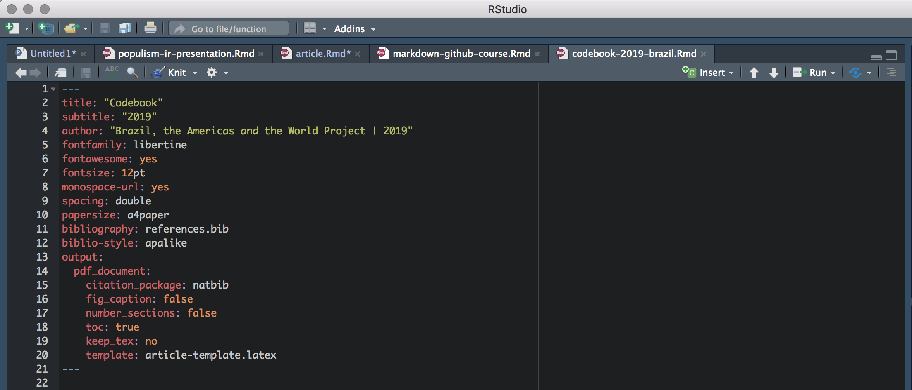

```{r xaringan-themer, include=FALSE, warning=FALSE}
options(htmltools.dir.version = FALSE)
library(xaringanthemer)
style_mono_accent(
  base_color = "#FFC0CB",
  header_h1_font_size = "2.25rem",
  header_h2_font_size = "1.85rem",
  header_font_google  = google_font("Bree Serif"),
  text_font_google    = google_font("Tajawal", "300", "300i"),
  text_font_size      = "1.3rem",
  code_font_google    = google_font("Fira Mono")
)
```

# Antes do Curso RMarkdown + GitHub

- Criar uma conta no GitHub: https://github.com/
- Baixar o git no seu computador: https://git-scm.com/downloads
- Baixar o pandoc no seu computador (é pesado, seu computador precisa ter espaço): https://pandoc.org/installing.html
- Baixar o RStudio no seu computador: https://rstudio.com/products/rstudio/download/
- Baixar o LaTeX ou MikTeX no seu computador: https://www.latex-project.org/get/ 

O começo é chato, mas essas ferramentas servem pra muita coisa:
- Fazer codebooks e artigos cuja bibliografia se organiza sozinha;
- Fazer seu site pessoal (por exemplo: https://catarinaroman.github.io/ );
- Fazer páginas web para seus projetos (ex.: https://catarinaroman.github.io/las-americas/ );
- Fazer apresentações como esta que você está vendo agora! :))

Tudo pronto?

---
## Criando seu repo do zero

Aqui é realmente bem mais fácil usar a interface do GitHub.

1. tela inicial do GitHub
2. botão verdinho no canto superior esquerdo
3. nome sempre sem espaços (nomes dos arquivos também)
4. sempre colocar README.md
5. sempre colocar [.gitignore](https://www.toptal.com/developers/gitignore/api/macos,r,latex,python,vim,libreoffice,microsoftoffice)
6. MIT License
7. colocar seus arquivos no repo

Para criar pastas (força bruta -- tem um jeito bem melhor que explicarei depois!)

1. na interface, clicar no arquivo que já está no repo
2. clicar no lapiszinho para editar o arquivo na interface
3. mudar o nome do arquivo para **nome-da-pasta/nome-do-arquivo**
4. fazer isso para todos os arquivos que quer colocar dentro daquela mesma pasta

---
## Operacionalizando

Vamos aprender a mexer no GitHub e no RMarkdown ao mesmo tempo.

Por favor abra esse link: https://github.com/catarinaroman/crash-course .

Passos:

1. fork ou criar seu repo
2. copiar link do repo
3. abrir terminal
4. **cd ~/Desktop** | **cd C:\\Desktop** para Windows (ou algo do tipo rs)
5. **git clone "link-do-repo"**
6. **cd ~/Desktop/nome-do-repo**
7. **open nome-do-arquivo.Rmd**
8. fazer as alterações que você quer ao arquivo
9. voltar ao terminal
10. **git add .**
11. **git commit -m 'mensagem de commit'**
12. **git push**

---

## Seguindo (Git)

Quando já tenho o repo remoto e estou trabalhando em grupo, outra pessoa pode ter feito alterações aos arquivos. Se eu mexer nos arquivos desatualizados e tentar push eles para o repo, o git não vai gostar, e eu não vou conseguir fazer minhas alterações (ou então vou ter que começar do passo 2, e refazer as alterações).

**Importante**: Sempre antes de mexer num repo compartilhado, seguir os passos:

1. abrir o terminal
2. **cd ~/Desktop/nome-do-repo**
3. **git pull**

Assim, ele vai atualizar o seu repositório remoto com o que está online.

**Para criar pastas** basta organizar os arquivos dentro das pastas que você quer no seu repo remoto. Daí você segue os passos de commit normal.

---

## Criando branches

Branches são formas de duas (ou mais) pessoas trabalharem nos mesmos arquivos simultaneamente, ou então de usar os mesmos arquivos para diferentes propósitos. Por exemplo, quando estamos escrevendo um paper e queremos deixar os materiais suplementares no GitHub, fazemos um branch com tudo normal, e um branch para submission, onde temos os mesmos arquivos, mas tiramos todos os nomes dos autores.

Para criar um novo branch:

1. abrir o terminal
2. **cd ~/Desktop/nome-do-repo**
3. **git checkout -b nome-do-branch**
4. **git push -- set-upstream origin nome-do-branch**

---
## Seguindo (branches)

Para editar os arquivos de um branch que não é o master, preciso falar isso para o git:

1. abrir o terminal
2. **cd ~/Desktop/nome-do-repo**
3. **git checkout nome-do-branch**

Tudo o que eu fizer agora com os arquivos vai ser feito com os arquivos desse branch especifico. Para voltar para o branch principal:

1. **git checkout main**

---
## Manipulando documentos em RMarkdown

[RMarkdown Cheatsheet](https://rstudio.com/wp-content/uploads/2015/03/rmarkdown-reference.pdf)

Por favor abram o arquivo **codebook-2019-brazil.Rmd**.

---
# Criando documentos em RMarkdown

Ctrl+C, Ctrl+V é tudo 

Cabeçalho:



---

# Links úteis

[Markdown Cheatsheet](https://rstudio.com/wp-content/uploads/2015/03/rmarkdown-reference.pdf)

[TinyTeX](https://yihui.org/tinytex/)

[.gitignore](https://www.toptal.com/developers/gitignore/api/macos,r,latex,python,vim,libreoffice,microsoftoffice)

---

## Por hoje é só!

Semana que vem veremos: 

- Mais recursos para edição de documentos (imagens, plots, tabelas, etc.)
- GitHub pages
- Apresentações em html (Dá para abrir em qualquer computador, sem nunca desconfigurar nada!)

**Obrigada! :)**


