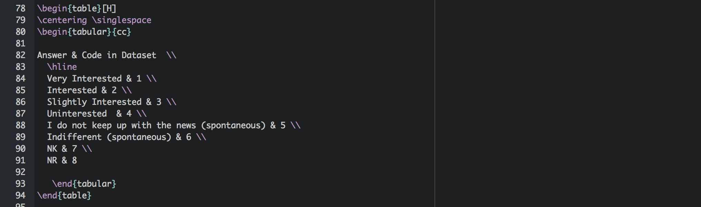

```{r xaringan-themer, include=FALSE, warning=FALSE}
options(htmltools.dir.version = FALSE)
library(xaringanthemer)
style_mono_accent(
  base_color = "#FFC0CB",
  header_h1_font_size = "2.25rem",
  header_h2_font_size = "1.85rem",
  header_font_google  = google_font("Bree Serif"),
  text_font_google    = google_font("Tajawal", "300", "300i"),
  text_font_size      = "1.3rem",
  code_font_google    = google_font("Fira Mono")
)
```

# Semana passada vimos

- Como usar a interface do GitHub
- Como criar repositórios
- Como manipular arquivos no repositório remoto
- Como subir atualizações para o repositório online
- Como criar novos arquivos de RMarkdown
- Como compilar arquivos de RMarkdown

Tudo isso ok?

## Recomendação

Para acostumar com o RMarkdown, comece a escrever pequenas coisinhas como esse tipo de documento. Por exemplo, ao invés de fazer anotações de aula, tomar notas pessoais, começar rascunhos de projetos no Word, faça por aqui!

---

# Revisão do RMarkdown

Um link importante que não mandei ainda: [LaTeX cheatsheet](https://wch.github.io/latexsheet/) 

Cabeçalho:


---

# Revisão do RMarkdown

Inserir fotos (como essa abaixo): 

- 




---
# Voltando ao GitHub
## Criando branches

Branches são formas de duas (ou mais) pessoas trabalharem nos mesmos arquivos simultaneamente, ou então de usar os mesmos arquivos para diferentes propósitos. Por exemplo, quando estamos escrevendo um paper e queremos deixar os materiais suplementares no GitHub, fazemos um branch com tudo normal, e um branch para submission, onde temos os mesmos arquivos, mas tiramos todos os nomes dos autores.

Para criar um novo branch:

1. abrir o terminal
2. **cd ~/Desktop/nome-do-repo**
3. **git checkout -b nome-do-branch**
4. **git push -- set-upstream origin nome-do-branch**

---
## Seguindo (branches)

Para editar os arquivos de um branch que não é o master, preciso falar isso para o git:

1. abrir o terminal
2. **cd ~/Desktop/nome-do-repo**
3. **git checkout nome-do-branch**

Tudo o que eu fizer agora com os arquivos vai ser feito com os arquivos desse branch especifico. Para voltar para o branch principal:

1. **git checkout main**

---

# GitHub pages

Por favor, entrem no link: https://catarinaroman.github.io/las-americas/
Clique. no botão "View on GitHub".

Vamos aprender a fazer essa página de um jeito muito fácil.

Caminho:

- Main branch do seu repo
- Settings
- Abaixe até aparecer GitHub pages
- Source --> Main
- Template --> Escolha o que preferir
- Criado o site, vamos ver os documentos
  * index.md
  * _config.yml
  
É possível mudar os parâmetros do template (eu acho), mas é preciso descobrir quais os argumentos que fazem isso -- que não sei quais são.

---

# Apresentações em .html


